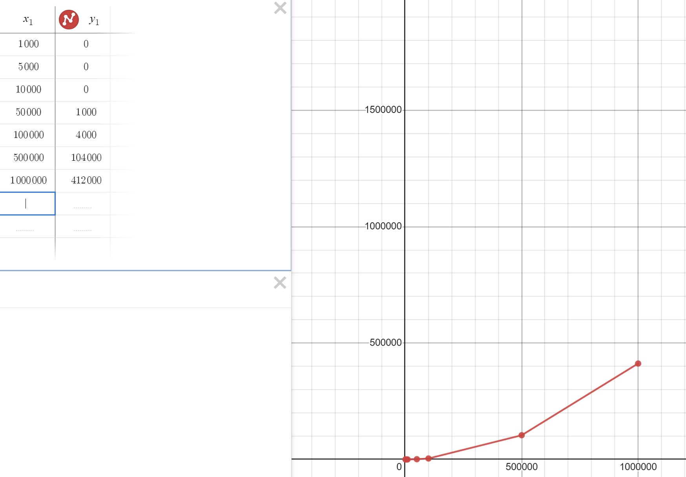
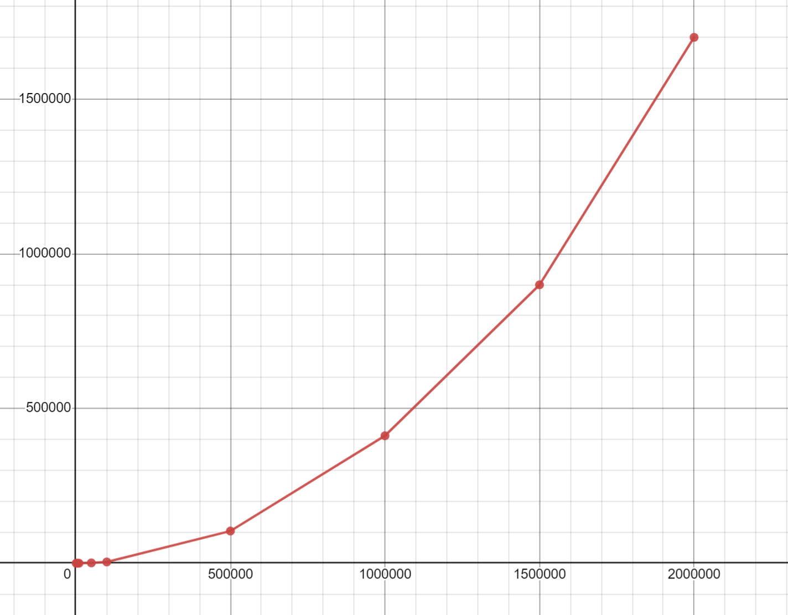
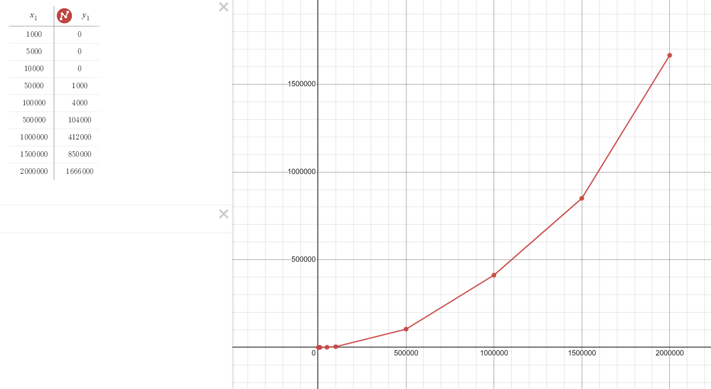

# Project-Array
## Для всех тестов взято значение k=2
Наш график:
\
Здесь я домножил наше время на 1000 для наглядности
Наш график похож на график квадратичной функции

Основываясь на этом попробуем предположить какое время будет при 2000000

По моему  прогнозу вышло около 1700 секунд

| N | Ответ | Время рассчета (сек) |
|-|-|-|
|1000 | 977 | 0|
|5000 | 1809 | 0|
|10000 | 3617 | 0|
|50000 | 34465 | 1|
|100000 | 68929 | 4|
|500000 | 475713 | 104|
|1000000 | 951425 | 412|
|2000000 | 1902849 | 1666|

После запуска кода итоговое время получилось 1666 секунд
Вот так выглядит наш финальный график:

# Сложность алгоритма O(N^2)